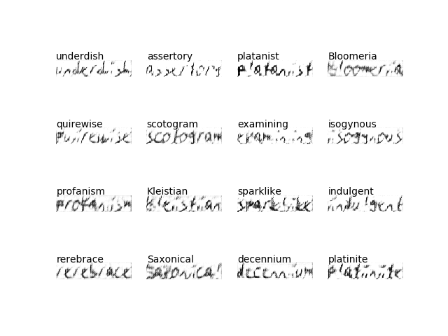

# ScrabbleGAN (TensorFlow 2/ Python3)

Implementation of [ScrabbleGAN](https://arxiv.org/pdf/2003.10557.pdf) for adversarial generation of handwritten text images in TensorFlow 2.1.

<p align="center">
  
</p>

 ## Try it out!
 [](https://colab.research.google.com/drive/1-JxJsYbAM9W69nTxSKTp-gR3ofwv5SjM?usp=sharing)

 Example on how to train ScrabbleGAN + how to generate images. [More details can be found here](https://towardsdatascience.com/scrabblegan-adversarial-generation-of-handwritten-text-images-628f8edcfeed).
    
 ## Setup (only tested on MacOS)
 
 1. Download and extract [IAM-Handwriting DB](http://www.fki.inf.unibe.ch/databases/iam-handwriting-database/download-the-iam-handwriting-database) 
 and [random word list](https://www.dropbox.com/s/o60ubzh3m163j0x/random_words.txt?dl=0) as described in src/dinterface/dinterface.py
    
    ```
    wget --user <user-id> --password <pw> http://www.fki.inf.unibe.ch/DBs/iamDB/data/words/words.tgz 
    wget --user <user-id> --password <pw> http://www.fki.inf.unibe.ch/DBs/iamDB/data/ascii/words.txt
    wget -O random_words.txt https://www.dropbox.com/s/o60ubzh3m163j0x/random_words.txt?dl=0
    tar zxvf words.tgz
    rm -rf words.tgz       
    ```      
 2. Move folders into correct position (see File Structure); update file paths in scrabble_gan.gin + main.py 
 3. Install dependencies (e.g. [AWS P3](doc/installation_aws_p3.txt))
 
 ## Usage
  
Train model
    
    python3 main.py
 
 ## File Structure
 
     doc
         ├── installation_aws_p3.txt                    # how to install dependencies on AWS P3 instance
         ├── ...                                        # addtional README resources
     res                               
         ├── data/                                      # various word datasets (e.g. RIMES, IAM, ...)
             ├── iamDB/                                              
                 ├── words/                                          
                 ├── words-Reading/ 
                 ├── words.txt                                            
             ├── random_words.txt/                                  
         ├── out/                                       # location where to store generated output files   
             ├── big_ac_gan/                            # output of ScrabbleGAN (here denoted as big_ac_gan)
                 ├── images/                            
                 ├── model/                             
                 ├── training_checkpoints/              
             ├── ...                                    # potentially output of more models   
     src
         ├── bigacgan/                                  # ScrabbleGAN implementation
             ├── ...                                           
         ├── dinterface/                                # purpose: bring various datasets into equal format
             ├── ...                                         
         ├── main.py                                    # core of this repo - train ScrabbleGAN
         ├── scrabble_gan.gin                           # all dependencies are handled here (gin config file)
    
 ## License
 [License](LICENSE)
